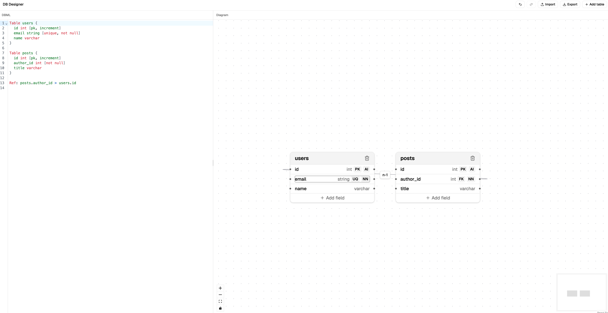

# DB Designer



A browser-only database schema design tool. Write [DBML](https://dbml.dbdiagram.io/docs/) and watch a visual ER diagram appear, or build the schema directly on the canvas and watch the DBML update to match — the two stay in sync in both directions. No backend, no accounts: everything runs client-side, and schemas are saved to your browser and exported to/imported from local `.dbml` files.

## Features

- **DBML ⇄ diagram sync** — edit DBML text or the diagram; both update to match, backed by a single normalized schema store.
- **Visual table & field editing** — add/rename/delete tables and fields, toggle primary key / auto-increment / unique / not-null, all from the canvas.
- **Relationships** — draw foreign keys by dragging between fields, edit cardinality (`1-1`, `1-n`, `n-1`, `n-n`) from the diagram.
- **Import/export** — save and load `.dbml` files to/from local disk.
- **Autosave & undo/redo** — your schema persists across reloads; undo/redo covers both diagram edits and DBML text edits.

## Tech stack

React, TypeScript, and Vite, styled with Tailwind CSS and shadcn/ui. [React Flow](https://reactflow.dev/) powers the diagram canvas, [Zustand](https://zustand.docs.pmnd.rs/) holds the schema state (with [zundo](https://github.com/charkour/zundo) for undo/redo), and [@dbml/core](https://www.dbml.org/) handles DBML parsing.

## Getting started

This project uses [Bun](https://bun.sh/).

```bash
bun install
bun run dev       # start the dev server
bun run build     # type-check and build for production
bun run lint      # run oxlint
```

See [CLAUDE.md](CLAUDE.md) for architecture notes and [knowledgebase/](knowledgebase/) for the implementation plan.
